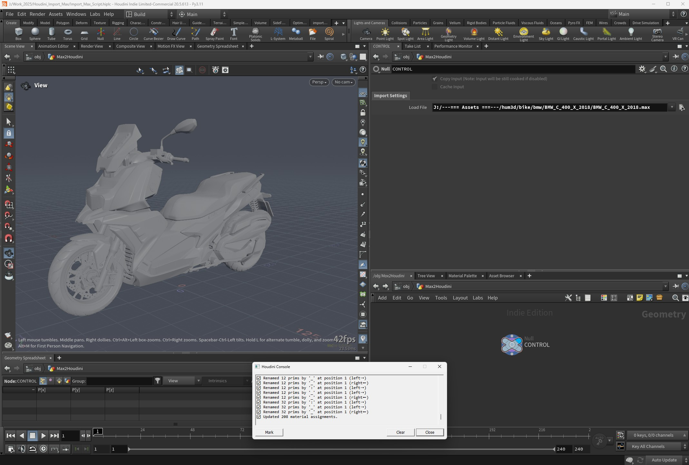

# Houdini Universal DCC Importer

**Universal DCC Importer for Houdini – MAX • Maya • LightWave • Other DCC/CAD apps → Houdini → Unreal Engine (via Houdini Engine)**

*Work in Progress (Alpha release)*  
---

## 🚀 About
**Houdini Universal DCC Importer** is a tool for fast and reliable import of 3D data from various DCC and CAD applications directly into Houdini.  
It supports formats such as **3ds Max**, **Maya**, **LightWave**, and many more, with options for automatic cleanup, attribute adjustments, and asset preparation for **Unreal Engine** via the **Houdini Engine plugin**.

---

## 🖼 Example Import
Example of importing a `.max` file with the Houdini Universal DCC Importer:  
- Geometry is processed  
- Primitives are renamed  
- Material zones prepared for later conversion  

---

## ✨ Features
- **Multi-format import** – MAX, MA/MB, C4D, Blender, and more
- **Automatic cleanup & housekeeping**
  - Remove unused attributes
  - Standardize object names (`name`) and store source file path (`srcfile`)
  - Option to keep or regenerate normals
- **Packed prims** for efficient handling of large scenes
- **Unreal Engine Ready** – run directly inside UE5 via Houdini Engine
- **Locked HDA** – protected code, easy distribution

---
## 📅 Roadmap
**Planned new formats**  
C4D (.c4d) • Blender (.blend) • Modo (.lxo) • SketchUp (.skp) • Rhino (.3dm)  
STEP / IGES / SolidWorks • ZBrush (.ztl)

## 📅 Planned Formats & Features
**Planned new formats:**
- Cinema 4D (.c4d)
- Blender (.blend)
- Modo (.lxo)
- SketchUp (.skp)
- Rhino (.3dm)
- STEP / IGES / SolidWorks
- glTF/GLB, PLY, STL, ZBrush (.ztl)

**Planned features:**
- Batch import
- Per-format import presets
- Automatic LOD generation
- Material conversion to PBR (MaterialX / UE5)
- CLI support
- Live Link Houdini ↔ UE5

---

## 🎯 Use Cases
- **Game studios** – receive and prepare assets from external teams for the engine
- **Visualization studios** – import client data without complex setup
- **Freelance 3D artists** – speed up workflow and unify results
- **Technical pipelines** – centralized import hub for multiple formats

---

## 🛠 Requirements
- Houdini 20.0+
- (for UE integration) Unreal Engine 5.x + Houdini Engine plugin

---

## 📜 License & Disclaimer
This tool is not affiliated with or endorsed by Autodesk, NewTek, Maxon, McNeel, or any other software vendor.  
It does **not** include or distribute any proprietary SDKs, APIs, or libraries from third parties.  
All import functionality is implemented with independent, clean-room methods based only on user-owned files.  

The user is responsible for ensuring they have the necessary rights or licenses for any data processed with this tool.  
The author is not liable for any license violations or infringement of third-party rights.

---

## 📥 Download & Installation
1. Download the `.hda` file from [Releases](../../releases)
2. In Houdini: **File → Import → Install Digital Asset Library**
3. Add `UniversalDCCImporter` to the network, select a file, and click **Import**
4. (Optional) Run directly inside UE5 via Houdini Engine

---

## 📓 Changelog
See [Changelist_EN.md](./Changelist_EN.md) for detailed development history.  

---

⭐ If you find this tool useful, give the repository a **Star** and support its development!
